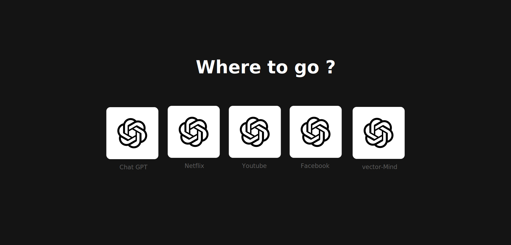

# This React Tailwind Test

I had a Task to simulate these interfaces using **React** and **Tailwind CSS**.

## First Test

## Second Test

## Third Test

- [x] First Test (Completed)
- [x] Second Test (Completed)
- [x] Third Test (Completed)
